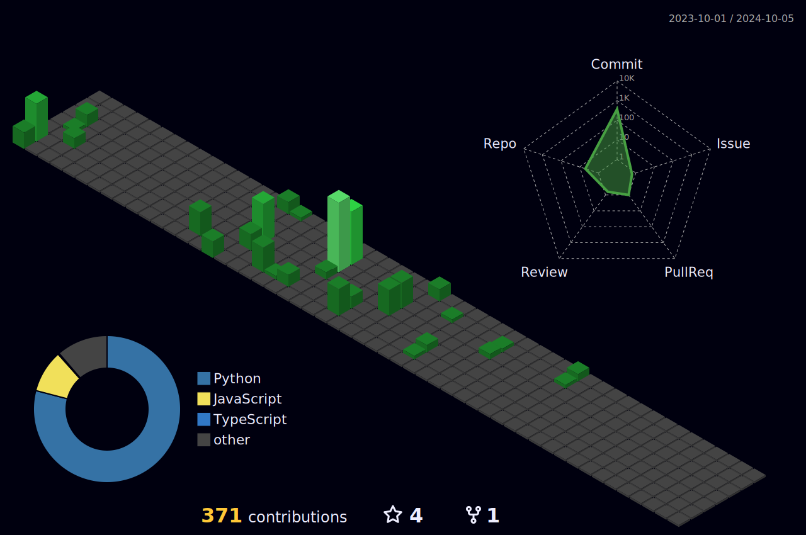

<!-- Intro -->

<h3 align="center">
	Hello and welcome :smile:
</h3>
  

	  I'm a tech chameleon on a quest for a Master's in Computer Science at RIT, with a fiery passion for gobbling up new skills and tech goodies in the realms of Data Engineering, Software Sorcery, and Machine Learning wizardry 🚀🧙‍♂️

<!-- Socials --> 
 
<h3 align="center">
	Connect with me:
</h3>  

<!-- Tech Stack

<h3 align="Center">Tech Stack:</h3>  -->  
<!-- 

 -->
<!-- -->
<!--   -->
<!-- -->
<!--  

 -->
<!-- -->
<!-- -->
<!--   -->
<!--  -->
<!--  -->
<!--  -->
<!--  -->
<!--  -->
<!-- 

 -->
 
<h4 align="center">
	Head <a href="https://github.com/sidharthaA/sidharthaA/discussions/1">over here</a> to engage, share, ask questions and collaborate together!
</h4>

 

	

 

	
	

# Languages

<h4 align="center">Most used languages (by number of commits)</h4>

	

 

	
	

# Contributions
<h4 align="center">Isometric view of contributions in the last year. Languages pie is based on recent commits</h4>

	

# Projects

## Full-stack

	
	

	
	

## Everything Data

	
	

	
	

	
	

## Machine Learning

	
	

	
	

	
	

# Technologies

### Programming Languages

### Big Data

### Databases

### Hosting/SaaS

### Frameworks and Libraries

### ML/DL Libraries

### ORM

### IDE:

### Version Control

### CI/CD

### Other

# Metrics

	

